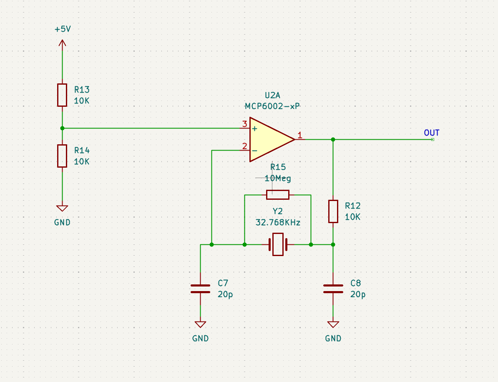
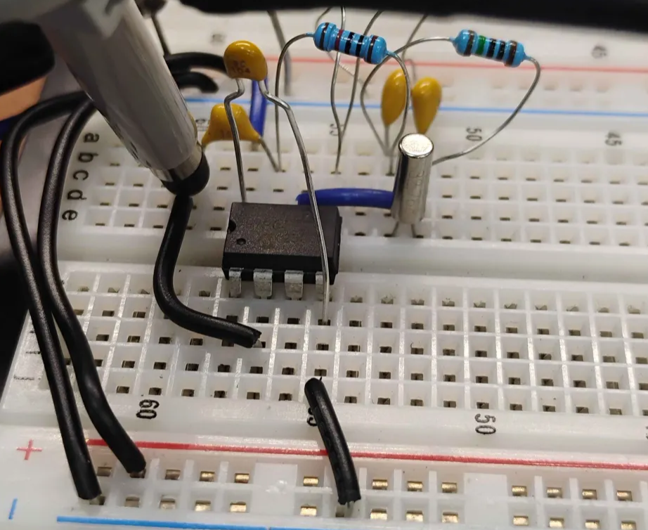
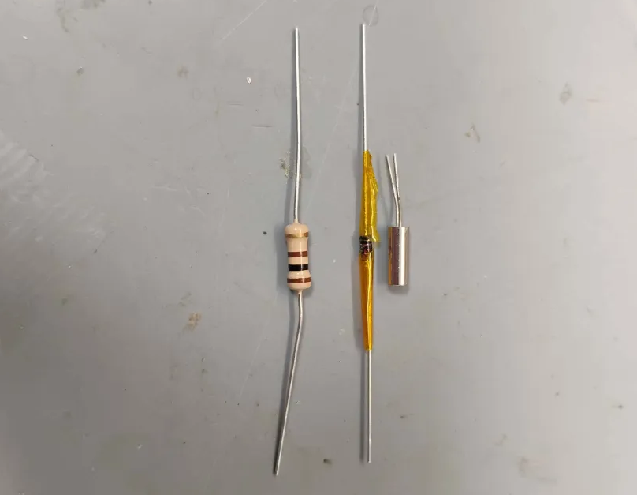
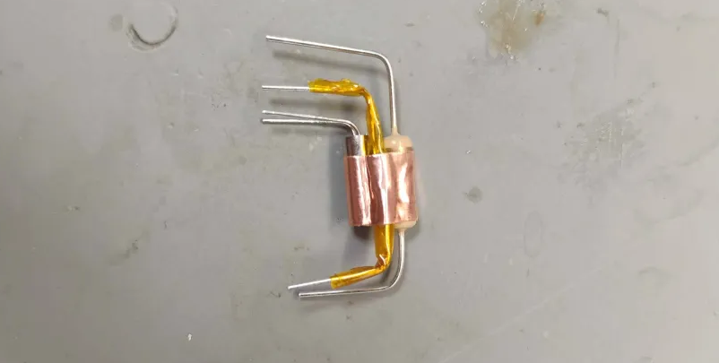
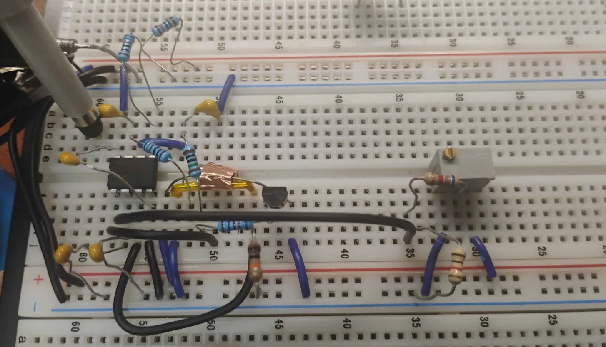
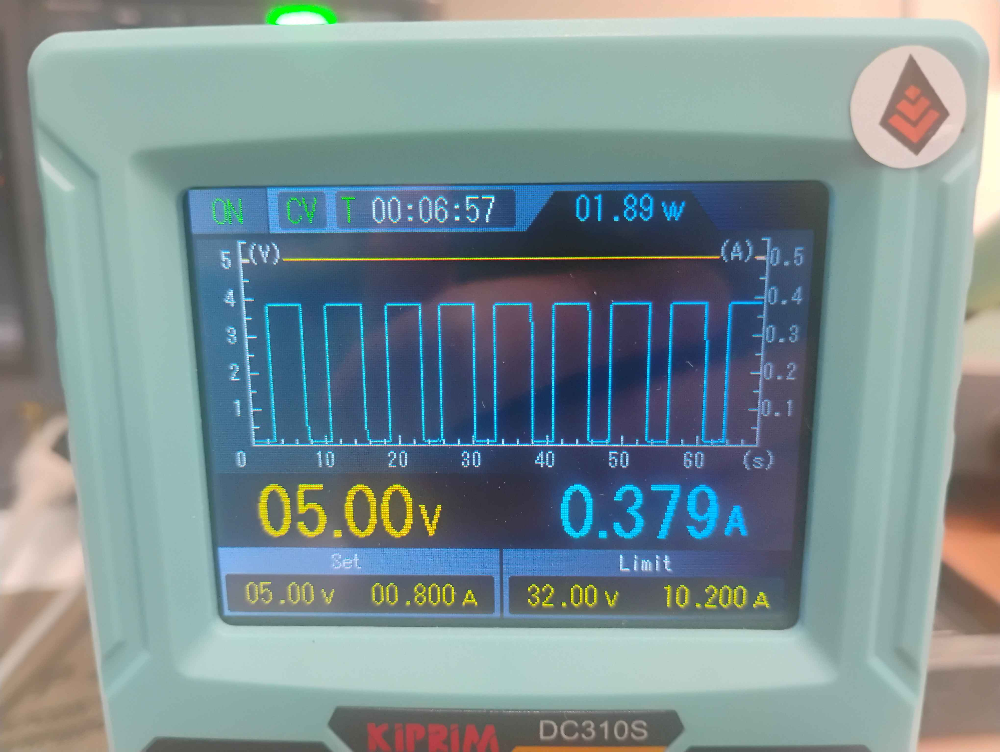
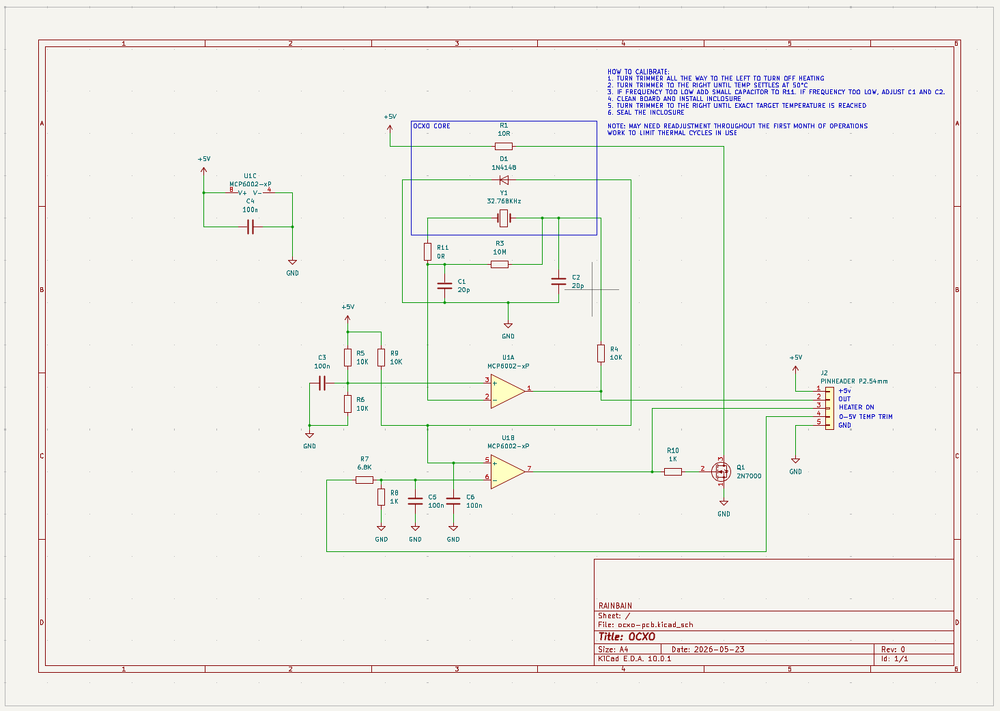
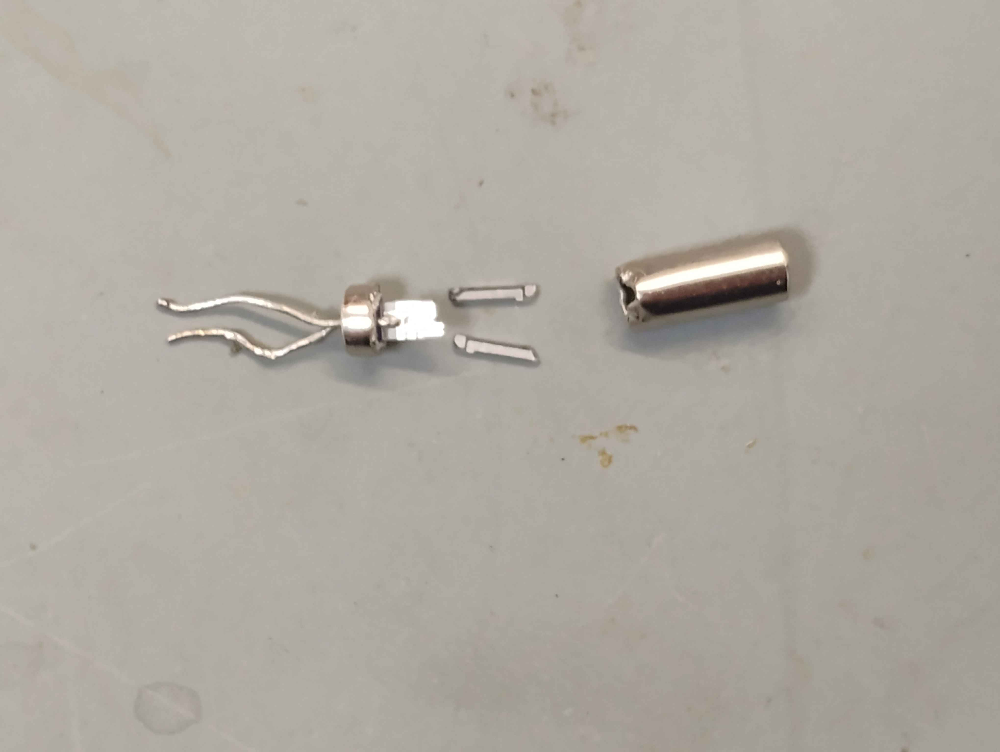
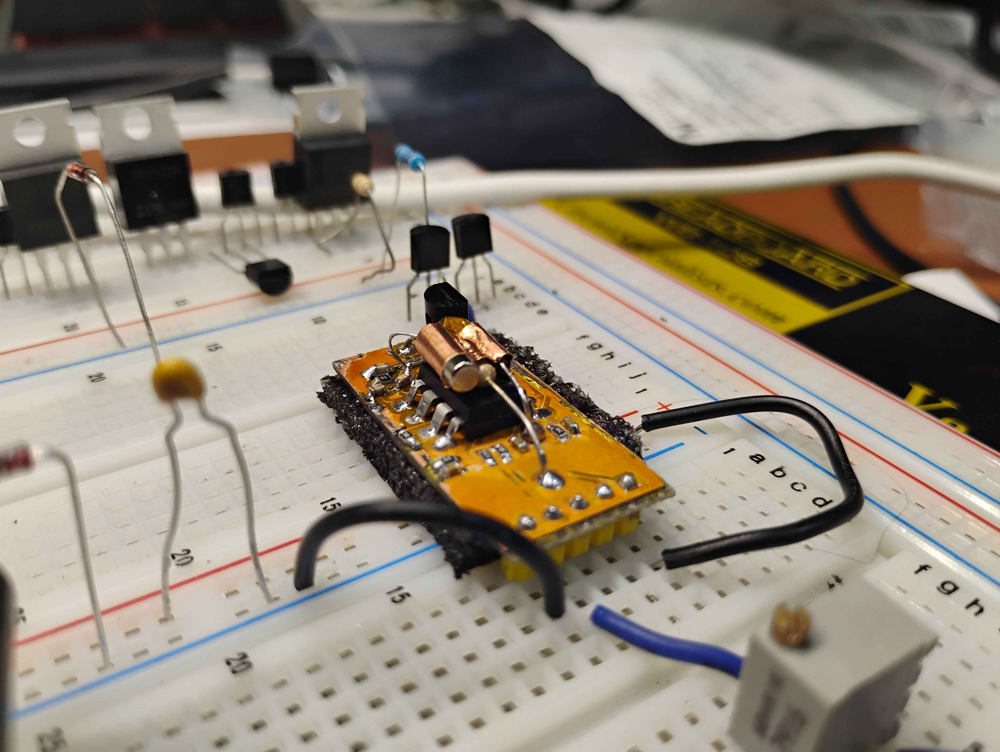
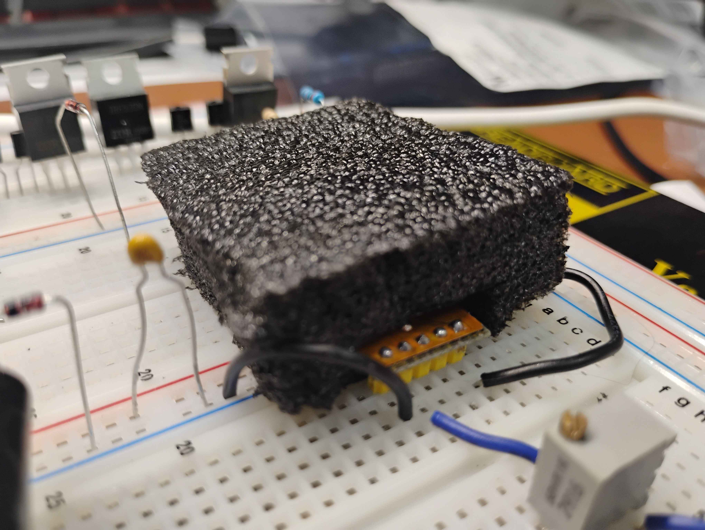

## Introduction
I came into the office on a 3 day weekend to mess around with some hobby projects today.
But then I realized, I could work on the usual, but, crystal oscillators sure are cool, so for no real reason, I decided to make my own OCXO.

### Why I love Clocks

As a lover of radio communications and digital logic, timing circuits are one of my favorite bits of technology. There is something spiritual about clocks. The idea, that a device, ticking every second, using modern technology, can tick no more than 1 extra time a year. It has no concept of time relative to other clocks, but can keep it so accurately, that it seems like the whole world is in sync.

For most of our time as a species on this earth we kept time by watching the setting of the sun, and the orbit of the earth around the sun. This is an amazingly accurate and useful measurement of time, off by only 30 minutes a year as its influenced by the orbits of other celestial bodies, mainly Jupiter.

But it's not until recently that we can produce device capable of keeping time beyond levels even really imaginable. Today we will dip our toes into the world of timing and make one of the most interesting and precise budget timing methods, the OCXO.

### What Are OCXOs
OCXOs are comprised of a tuned crystal resonating at a chosen frequency. Then, a small insulated heated box, the oven, keeps this crystal, and its driving circuitry, at a precise constant temperature. This keeps the frequency stable and the aging predictable.

OCXOs are known for exceptional accuracy and long term stability compared to standard temperature compensated crystal oscillators (TCXO). It is hard to find a TCXO under 1 parts per million frequency error (ppm) in the 32.768 KHz range, while OCXOs are often found to be in the range of 50-500 parts per billion (ppb). This is about as close as you can get to an atomic clock without actually having an atomic clock or GPS unit. Atomic clocks are still many orders of magnitude more accurate, and honestly can not even be easily measured in ppb.

The standard TCXO is often off 1-2 minutes per year. A good OCXO will be off by less than or up to a few seconds a year.

OCXOs have many downsides. While a TCXO may use microamps, OCXOs are often in the 10-100 milliamp range to keep heated. Further, they take time to warm up, usually around 10 minutes. Lastly, for units accurate down to a few ppb, they are vulnerable to thermal cycling that may destroy calibration.

### What I Made
Now, I am no expert in oscillators, so I acknowledge my method may not exactly match that used by an off the shelf OCXO. Despite that, the core concept is there. We will build a crystal oscillator, add a heater, calibrate it, and see how it performs.

My design is quite simple. There is no fancy dynamic frequency adjustment like a TCXO. This design will be tuned to be close enough, then the temperature adjusted and held stable until its near perfect.

Despite the simplicity, the results are spectacular, and making it, gets quite in-depth to some very integral topics in engineering.

## The Crystal
I started with a 32.768 KHz crystal I found floating around in a random box. I don't know who made it, or how good it is. I would guess its probably rated for like 100-200 ppm just based on how it performed initially.

What we will use to drive the crystal is a [Pierce Oscillator](https://en.wikipedia.org/wiki/Pierce_oscillator). This uses an inverter to drive the crystal out of phase and resonate. There is a bit more into equivalent circuits to crystals and their electrical parameters that I am skipping over here, but basically the crystal acts like a series LC tank, and if you do an upside down hand stand, it looks like a [Colpitts Oscillator](https://en.wikipedia.org/wiki/Colpitts_oscillator)

I made one using MCP6002 OpAmp. This is an inverting amplifier, so since were not in a split rail configuration, I have DC biased the non-inverting input. The 10Meg resistor helps it get oscillating and helps for the OpAmp to not start in some wild open loop setup. If you have seen the uninstalled resistor across crystals in development boards, this is why.

Here it is built on a breadboard.

Here is a video of it operating. In the video, I actually touch it with my hands to offset the frequency. I am measuring the frequency by looking at the beat frequency by our oscillator frequency in yellow, and our waveform generator in green. The oscillator was 2.2 Hz off, I tuned the frequency generator to this frequency for the hand warming demo, so we do not see that 2.2 Hz beat frequency here.


### Crystal Performance
The crystal alone on a breadboard has a LOT of room for performance.

It was 2.2 Hz off, 67ppm off. This alone would be 5.8 seconds off a day. After a year, it's about 34 minutes off. So about as precise as the orbit of the earth around the sun. I mean that's still really good, but we can take this so much farther.

## OCXO Breadboard Prototype
Let's make our first OCXO on the breadboard.

### The Core
We will want to add a heating element and temperature sensor to our crystal.

For this I will use a 10 ohm resistor as the heater. At our 5V rail that can give us at most 2.5W of heat. A 1N4148 diode as a temperature sensor. It will experience roughly 20mV change in the junction voltage drop per degree C. This is all thermally coupled together with our crystal using some copper tape.

In the photos I used a 100 ohm resistor. I changed this out for 10 ohms since the MCP6002 takes up to 5V only, and the 100 ohm resistor can not supply enough heat at that temperature.

### The Electrical

This circuit I winged. I do not have an exact schematic for it. There are a few important design decisions though I made when figuring it out.

#### Frequency Tuning
Our initial frequency is 2.2Hz too low. Increasing the temperature of this crystal causing the frequency to go down. So we don't just need to correct for the 2.2Hz first, we need to go even a bit higher so that we can apply the heating.

To do this you need to lower load capacitors. The two 20pF caps. But lowering these to zero did not get me there, it did though, make it unable to cold start, so that's not good. This is likely due to really bad parasitic capacitance of the breadboard adding up. I instead found I could add a small series capacitor to the crystal to bump the frequency up. So instead of working against parasitic capacitance, in the photo, you can see that one lead of the crystal looks unconnected. I used the parasitic capacitor between two of the rails of the breadboard as the capacitor here. There is a first for everything I guess.

After doing this though, we jumped up by about 5 Hz. Time for heating.

#### The Heating Controller
The heating is low side switched with a 2n7000. This MOSFET has a poor series resistance, so its not good for load switching, but here, that's fine, its just free heat.

This MOSFET is driven by the other MCP6002 (there is two of them in that chip), as a comparator. Since diode junction voltage drop, falls as temperature increases, I have a 10K pull up on it, and the diode to ground, producing a voltage equal to that voltage drop.

Then, a trimmer and voltage divider makes our 0-0.7V reference line.

The thermal probe goes to the non-inverting input, and the reference to the inverting. The voltage drop starts high and turn it on. As it heats up it creeps down, and once it gets near the reference, switches off the heater, until it cools off and turns it back on. The temperature does move back and forth a tiny bit, but in general it does a ok job.

I should note, most OpAmps don't do well with such low voltages near their rails. You need a rail to rail amplifier. Secondly, they usually dont like open loop, and when their two inputs become very close, they may not produce an all the way on or all the way off signal, and make something in between. The MCP6002 is my go to for low frequency linear circuits as it does not suffer from this and can be used very general purpose in these circuits.

### Results
I adjusted the temperature until the frequency was right. Unlike last time, we're at the target frequency of 32.768 KHz. 

The heater comes on a lot when it first turns on, but stabilizes in a nice PWM once left on. We can see that PWM on this current graph.

The beat frequency this time is super low. Instead of a continuous drift to one direction, it seems to move around back and forth randomly. This is its stability being bad. Seems that turning off the oscilloscope, letting it cool down, and using it again, causes this to happen more. Sounds like were pressing up against the frequency stability of the oscilloscope now.



It took 53 seconds for 1 beat. That gives us a rough accuracy of 0.018 Hz. We are now to 550 ppb. We crossed 3 orders of magnitude with a bit of tuning and compensation!

Assuming it was a bit more stable too, it would be off by 17–18 seconds a year now, not a day like last time.

I am also happy to say, I turned it off and went out to my favorite restaurant for dinner.  When I got back, and let it heat up again for 10 minutes (including the oscilloscope), it resumed the same level of stability and accuracy. 

The big issue now is the whole air currents thing. I can tell by me walking by it, or the AC turning on, it shifts in frequency. We will want to put this in a insulated box.

## OCXO Prototype 2
Now that I have a design, I wanted to go ahead and manufacture it so we can get some real data!

### Schematic

This schematic is mostly what was on the breadboard but with some extra filtering caps, and installed the trimmer outside of the board on a 5 pin connector.

The PCB will ideally be somewhat thermally connected to the core for even more stability.
I included calibration notes too for how I would like to ideally calibrate this design.

### Building It
I manufactured a PCB for it then assembled it using the parts on the breadboard. It went mostly smoothly. I did have to replace C1 and C2 with 13pF capacitors though. Seems the change over from breadboard to PCB changed our parasitics significantly. I also had to install a 13pF capacitor into R11 to increase the frequency and give us room for temperature compensation.

Once it seemed well calibrated, I threw it into the ultra sonic cleaner to remove any flux. (Something that seems to have damaged the crystal.) The silkscreen proved to have adherence issues. I had this issue with the last board I made too, and its only become an issue after using this new brand of solder mask despite my sanding and cleaning. So we lost a bit of solder mask on the board after cleaning.

### Sudden Death
I was about to take a photo of the board, and it working. Then, as I was using it, the signal suddenly died off. I tried a few last ditch efforts to try and soft start it by introducing noise or my own signal to see if it was an oscillator loading or gain issue.

This proved futile though. It seemed to be very dead, and would no longer resonate at all.

At this point I changed out the watch crystal for a new one. It started working! I have never in my life seen a watch crystal just break, and I worry its probably due to abuse or the sonic cleaner. Hopefully this does not become a recurring issue. I will update this if it does.

In the mean time, here is a picture of the inside, it is my assumption I probably broke the tuning fork when taking it out, not a result of its death, since both forks are broken off here.

### Finished Prototype
Here is the final build. I cut a foam box for it as well.

### Results

#### Accuracy
After adjusting, I got an instantaneous accuracy of 100 ppb. Its not held this very well and drifted over the day to around 200-300 ppb.

More data is needed to know how it will age. This seems to be mainly limited by poor temperature control and my ability to measure it.

In general though, this is pretty good, being off 10-20 milliseconds per day if this continues. This is 4-6 seconds a year!

To know more though, we will need a lot more testing and data.

#### Stability
Stability is much improved over the first revision. It seems to always be in the same small thermal cycle loop now, and will continue to follow the same pattern until adjusted. Insulation is really the way to go to keep these stable.

#### Short Term Error
This one is very bad. The clock tends to have its phase drift around during each thermal cycle. So every 10-12 seconds its frequency goes up a bit, then back down. It averages to the target frequency, but is just not nearly as accurate in the short term.

The heating system has no fancy controls, it just turns on when too cold. So combined with the time it takes the heat to conduct and the thermal mass, and you suddenly have a simple harmonic oscillator from physics class. 

I have included a video using the heating on out line to a LED to show that cycle, and how it affects the beat frequency phase on the oscilloscope. 




#### Overall
Overall I am quite happy with the results and will hopefully use this design and take more measurements in the future. You really never see watch crystal OCXOs, so it will be very interesting to see how it ages.

The reason you never see watch crystal OCXOs, making this one unique, is because they're tuning-fork-based and not commercially viable. This already makes them bad candidates for frequency and phase stability. Combined with a frequency already too low for RF generally, and there is no real reason to make them. These low frequency crystals are used for low power watches, being the reason we choose the low frequency, and OCXOs are just not known for low power.

GitHub repo with schematics, PCB design, and any future test results:
[Github Repo](https://github.com/rainbain/OCXO)

## Future Work
If I continue to work on this project, there are three goals we can look out for.

### Long Term Measurement
I want measurements, over 6-12 months, for how this device ages and offsets over time.

### Better Temperature Stability
The current temperature controller is bad. A smaller one, or a smaller thermal mass to limit oscillation, would be a great improvement.

The oscillation is very predictable though, and I bet with some control systems knowledge, we can cook up a fully analog controller that dampens this oscillation.

### Using It
I would like to build a fully discrete transistor logic clock in the future using this. Look forward to future blog post about this.